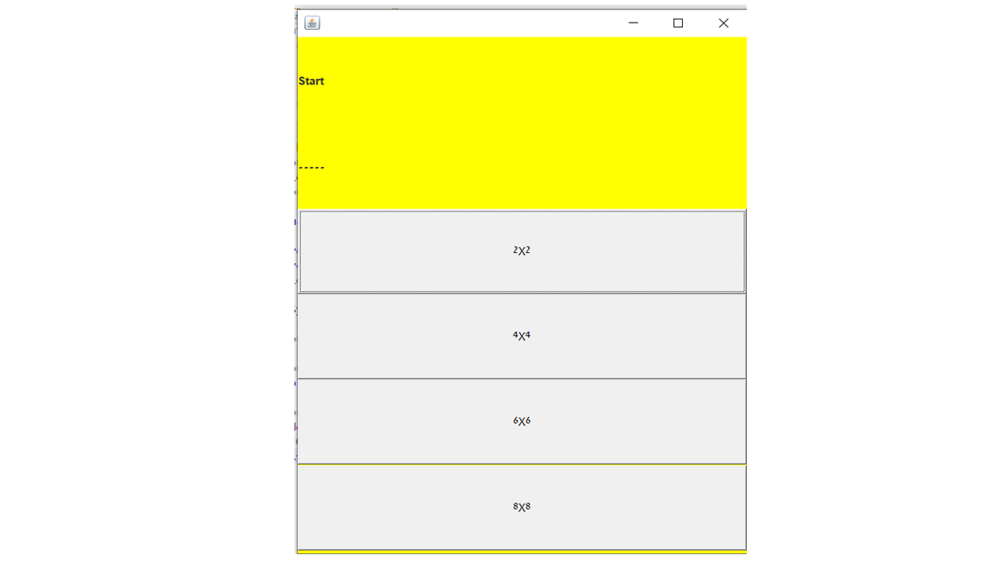
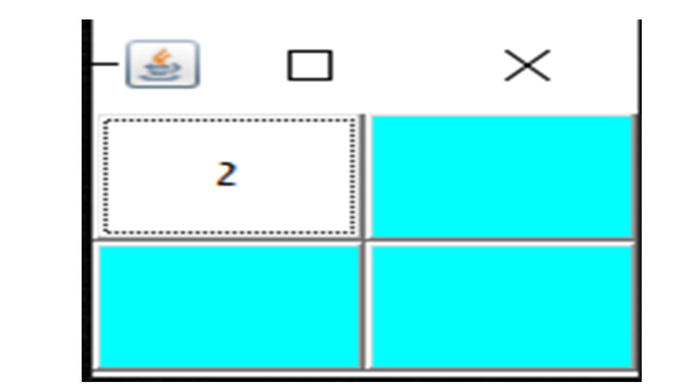

# 🎮 Memory Match Game — Java Edition


---

## 🧠 Overview

**Memory Match Game** is a classic interactive game designed to challenge your memory and provide a fun, responsive experience. Built using **Java AWT** and **Swing**, it offers multiple board sizes, immersive audio-visual feedback, and a polished GUI.

---

## 🎯 Why This Project?

> _"Learn by building!"_

Developed as a **final OOP course project**, this game had several key objectives:

- 👨‍💻 Hands-on practice with Java GUI programming  
- 🧩 Reinforce OOP principles like encapsulation, inheritance, and modularity  
- 🔊 Integrate sound effects into UI interactions  
- 🎓 Demonstrate software design and event-driven programming  

---

## 🖼️ Screenshots

### 📋 Game Menu — Board Size Selection  
 <!-- Replace with actual image path -->

### 🎮 Gameplay — Matching Phase  
 <!-- Replace with actual image path -->

### 🏆 Win Screen  
 <!-- Replace with actual image path -->

---

## 🕹️ Features

- ✅ Choose from board sizes: `2x2`, `4x4`, `6x6`, `8x8`  
- ✅ Interactive pop-up messages and notifications  
- ✅ Audio feedback for match/mismatch events  
- ✅ Match tracking with percentage display  
- ✅ Clean game loop with restart and exit options  

---

## 🛠 Tech Stack

| Tool         | Description             |
|--------------|-------------------------|
| Java         | Core programming language |
| AWT / Swing  | GUI development          |
| Eclipse      | IDE used for coding      |
| Windows 10   | Target platform          |
| Audio System | .wav sound integration   |

---

## 🧩 How to Play

1. 🎲 Run `Rashi.java` to start the game.  
2. 🧮 Select your preferred board size.  
3. 🖱 Click any two buttons to reveal numbers.  
4. ✅ Match? Great! ❌ Mismatch? Try again.  
5. 🏁 Repeat until all pairs are matched.  
6. ❌ Use the exit button to quit the game (with confirmation dialog).

---

## 📂 File Structure

```bash
📁 src/
 ┣ 📄 Rashi.java           # Main class
 ┣ 📄 Logical.java         # Game logic and validation
 ┣ 📄 CenteredFrame.java   # Game board UI
 ┣ 📄 StartFrame.java      # Menu and size selection
 ┣ 📄 AePlayWave.java      # Sound management
 ┗ 📁 sounds/              # .wav audio files

